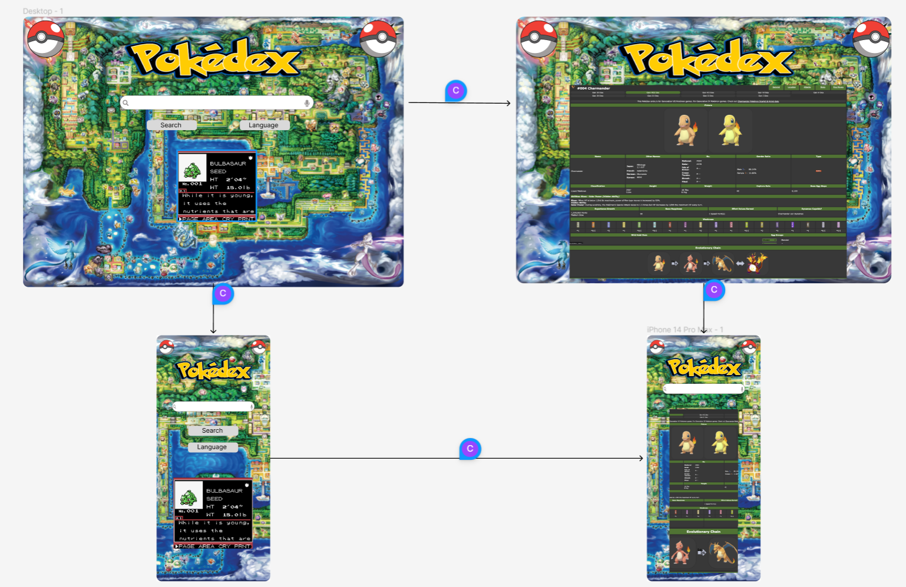

**Project Ekans Group**
-
**Pokémon Pokédex & Cards**
-

This project is to create an application to solve a real-world problem, we decided to create a Pokémon Pokédex to help enthusiasts of the franchise search for information on the pokémon they want to know more about and show pokémon cards related to their search, we decided to use the CSS framework FOUNDATION for this appplication but due to some difficulties we had to change our CSS framework to BULMA. 

Project Requirements:
-
- Use a CSS framework other than Bootstrap.

- Be deployed to GitHub Pages.

- Be interactive (i.e., accept and respond to user input).

- Use at least two server-side APIs.

- Does not use alerts, confirms, or prompts (use modals).

- Use client-side storage to store persistent data.

- Be responsive.

- Have a polished UI.

- Have a clean repository that meets quality coding standards (file structure, naming conventions, follows best practices for class/id naming conventions, indentation, quality comments, etc.).

- Have a quality README (with unique name, description, technologies used, screenshot, and link to deployed application).


**User Story**
```md
AS A Pokemon Game Fan and to celebrate the end of Ash Ketchum & Pikachu 25-year journey
I WANT to search for Pokemon 
SO THAT I can view information about the Pokemon I want 
WHEN I land on the page
I WANT to see Pokemon graphics and style
GIVEN I want to view the information in a leisurely & sentimental manner
THEN the search result must provide me randomize information of the pokemon I search to keep my engagement
AS A Pokemon Game Fan both the Nintendo Game Boy version and Card game
I WANT the search result to provide me both the information of view side by side in desktop
I WANT the search result to provide me both the information of top bottom on mobile
AS IT is a random generator,
I WANT the last 4 minimum succesfull search result to be prompt on active "when searching"
AS IT is a random generator,
I WANT to see random images, cards and of the pokemon I search to keep my engagement
THE SAME search is no longer boring
WHEN promopt with a non Pokemon search
THEN I am presented with references to no Pokemon is found
```

**Other Reference Link**

below is a link to our wireframe:

- https://www.figma.com/file/XTmvCTism6jFLKHmJtERq8/Ekans-Kanban-%26-User-Story?node-id=0%3A1&t=6upLGncRzqc3QBx2-1


below is a link to our project to-do list:

- https://github.com/users/momentes/projects/1/views/1


Once our application is deployed a link and a screenshot of our application will be below
- https://momentes.github.io/Ekans_Project_01/


**Credits & References/Resources**
-
- API Learnings - https://www.youtube.com/watch?v=Ogqo4YLrO3s
- API Learnings - https://www.youtube.com/watch?v=Y2a0Xv3giho
- API Learnings - https://www.youtube.com/watch?v=dVtnFH4m_fE
- Modal Learnigns - https://www.youtube.com/watch?v=6ophW7Ask_0
- Discord : TGCDex forum and user "bePrepared" 
- Website Credits - W3schools
- Website Credits - StackOverFlow
- Website Credits - Markdownguide.org
- Website Credits - https://www.jamesqquick.com/blog/build-a-pokedex-with-vanilla-javascript-part-2/
- Website Credits - https://dev.to/tqbit/how-to-make-api-calls-with-javascript-21cg
- Website Credits - https://www.section.io/engineering-education/how-and-when-to-apply-session-storage-with-javascript/
- Website Credits - https://codepen.io/xaca/pen/wveYQoq
- Image Credit, Pokeball - https://www.wikidata.org/wiki/Q19847
- Image Credit, Pokemon World - https://wallpaperaccess.com/pokemon-map
- Ash Ketchum a 25 year run of the Pokemon Adventure

**API's**
-
- https://pokeapi.co/api/v2/pokemon/
- https://pokeapi.co/api/v2/pokedex/2
- https://pokeapi.co/api/v2/pokemon-species
- https://api.tcgdex.net/v2/en/cards


This project is for Private use/learning classes and not for commerical or public consumption.Please get in contact if you wish to remove some of the refrences used.

Thank you End.

